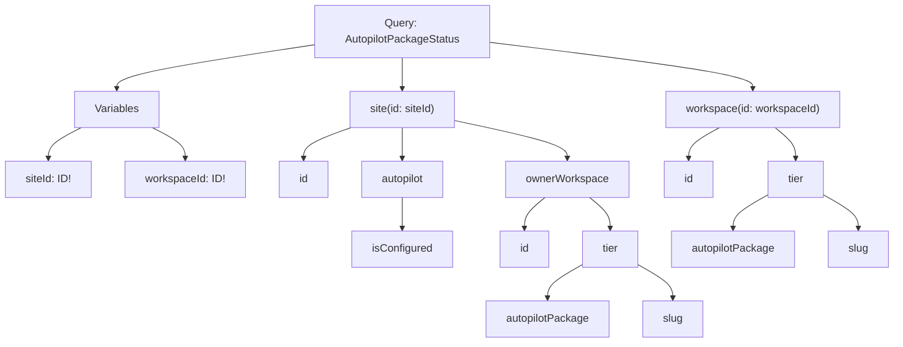

```mermaid
graph TD

A["Query: AutopilotPackageStatus"]

%% INPUT
A --> B["Variables"]
B --> B1["siteId: ID!"]
B --> B2["workspaceId: ID!"]

%% SITE CONTEXT
A --> C["site(id: siteId)"]

C --> C1["id"]

C --> C2["autopilot"]
C2 --> C2a["isConfigured"]

C --> C3["ownerWorkspace"]
C3 --> C3a["id"]

C3 --> C3b["tier"]
C3b --> C3b1["autopilotPackage"]
C3b --> C3b2["slug"]

%% WORKSPACE CONTEXT
A --> D["workspace(id: workspaceId)"]

D --> D1["id"]

D --> D2["tier"]
D2 --> D2a["autopilotPackage"]
D2 --> D2b["slug"]
```