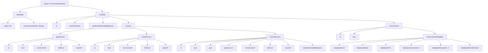

```mermaid
graph TD
    A[Query: CmsConnectionInfo]

    A --> B[Variables]
    B --> B1[siteId: ID!]
    B --> B2[environmentName: String!]

    A --> C[cmsSite]

    C --> C1[id]
    C --> C2[machineName]
    C --> C3[preferredDrAvailabilityZone]

    C --> D[servers]

    D --> D1[appServers]
    D1 --> D1a[id]
    D1 --> D1b[host]
    D1 --> D1c[environment]
    D1 --> D1d[failOver]
    D1 --> D1e[slaveOf]

    D --> D2[codeServers]
    D2 --> D2a[id]
    D2 --> D2b[host]
    D2 --> D2c[environment]
    D2 --> D2d[failOver]
    D2 --> D2e[slaveOf]

    D --> D3[cacheServers]
    D3 --> D3a[id]
    D3 --> D3b[host]
    D3 --> D3c[port]
    D3 --> D3d[password ⚠]
    D3 --> D3e[environment]
    D3 --> D3f[failOver]
    D3 --> D3g[slaveOf]
    D3 --> D3h[endpointAvailabilityZone]

    C --> E[environment]

    E --> E1[id]
    E --> E2[key]

    E --> F[environmentVariables]

    F --> F1[databaseHost]
    F --> F2[databaseName]
    F --> F3[databasePort]
    F --> F4[databaseUsername ⚠]
    F --> F5[databasePassword ⚠]
    F --> F6[databaseDomainName]
```