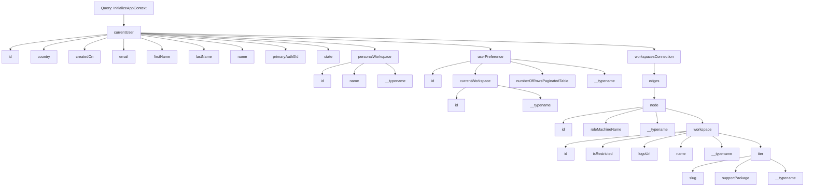

```mermaid
graph TD

A["Query: InitializeAppContext"]

%% ROOT
A --> B["currentUser"]

%% USER CORE
B --> B1["id"]
B --> B2["country"]
B --> B3["createdOn"]
B --> B4["email"]
B --> B5["firstName"]
B --> B6["lastName"]
B --> B7["name"]
B --> B8["primaryAuth0Id"]
B --> B9["state"]

%% PERSONAL WORKSPACE
B --> C["personalWorkspace"]
C --> C1["id"]
C --> C2["name"]
C --> C3["__typename"]

%% USER PREFERENCE
B --> D["userPreference"]
D --> D1["id"]

D --> D2["currentWorkspace"]
D2 --> D2a["id"]
D2 --> D2b["__typename"]

D --> D3["numberOfRowsPaginatedTable"]
D --> D4["__typename"]

%% WORKSPACES CONNECTION (MULTI WORKSPACE RELATION)
B --> E["workspacesConnection"]

E --> E1["edges"]

E1 --> E2["node"]

%% NODE LEVEL
E2 --> E2a["id"]
E2 --> E2b["roleMachineName"]
E2 --> E2c["__typename"]

%% WORKSPACE INSIDE NODE
E2 --> F["workspace"]

F --> F1["id"]
F --> F2["isRestricted"]
F --> F3["logoUrl"]
F --> F4["name"]
F --> F5["__typename"]

%% TIER INFO
F --> G["tier"]

G --> G1["slug"]
G --> G2["supportPackage"]
G --> G3["__typename"]
```