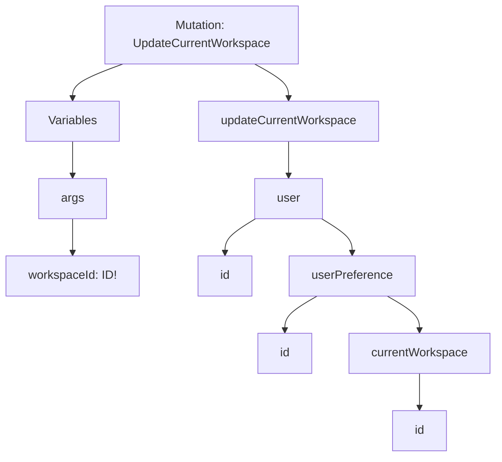

```mermaid
graph TD

A[Mutation: UpdateCurrentWorkspace]

%% ======================
%% INPUT LAYER
%% ======================
A --> B[Variables]
B --> B1[args]
B1 --> B2[workspaceId: ID!]

%% ======================
%% RESPONSE LAYER
%% ======================
A --> C[updateCurrentWorkspace]

C --> D[user]
D --> D1[id]

D --> D2[userPreference]
D2 --> D3[id]

D2 --> D4[currentWorkspace]
D4 --> D5[id]
```