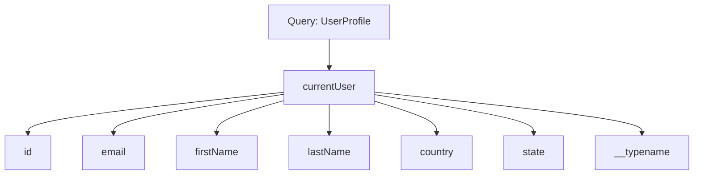

```mermaid
graph TD

A["Query: UserProfile"]

%% ROOT
A --> B["currentUser"]

%% CORE IDENTITY FIELDS
B --> B1["id"]
B --> B2["email"]
B --> B3["firstName"]
B --> B4["lastName"]
B --> B5["country"]
B --> B6["state"]

%% GRAPHQL INTERNAL TYPE
B --> B7["__typename"]
```