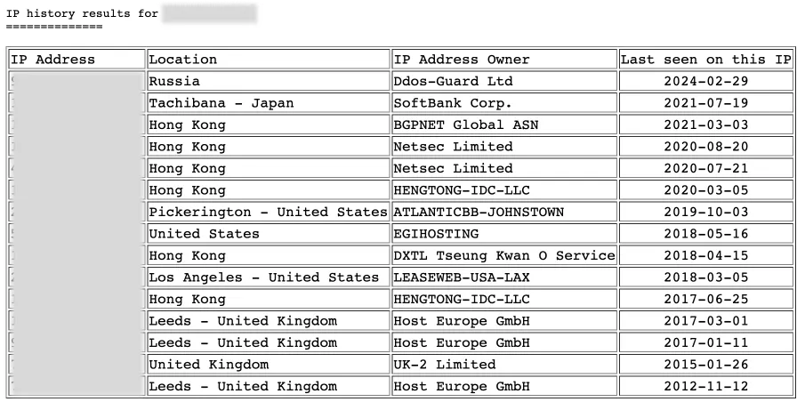
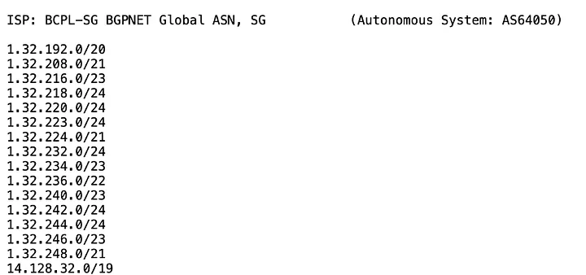
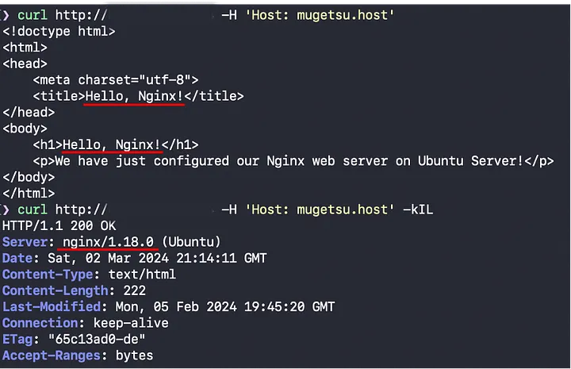

# Finding the Origin IP behind CDNs

Dalam dunia keamanan informasi, melindungi jaringan dan server dari serangan berbahaya adalah salah satu tugas prioritas. Di antara alat pertahanan utama adalah WAF dan CDN, yang membantu mencegah serangan pada sumber daya web. Namun, ketika bekerja dengan teknologi ini sebagai bagian dari Pengujian Penetrasi, muncul pertanyaan: bagaimana Anda mengetahui alamat IP asal ketika melewati CDN? Dalam artikel ini, kita akan melihat metode yang cukup sederhana dan praktis yang akan membantu kita menentukan alamat IP asli klien, bahkan dengan adanya proxy. 

## Mencari subnet

Kami mencari riwayat IP dari domain yang kami minati. Ada banyak sekali layanan online untuk tujuan ini, tetapi saya merasa lebih nyaman menggunakan yang ini: [https://viewdns.info/iphistory/](https://viewdns.info/iphistory/)

Jika Anda beruntung dan domain yang Anda minati meninggalkan jejak di suatu tempat beserta alamat IP-nya, Anda akan melihat sesuatu seperti ini: 



etelah itu, Anda perlu menyalin semua alamat IP dari riwayat domain, kecuali untuk Cloudflare dan layanan serupa. Selanjutnya, kita perlu mendapatkan daftar semua subnet dari penyedia tersebut. Ini dapat dilakukan di [https://suip.biz/?act=ipintpr](https://suip.biz/?act=ipintpr) dengan memasukkan setiap alamat yang tersimpan satu per satu. 



penyedia layanan internet Salin dan simpan subnet IPv4 ke dalam satu file teks. Jalankan masscan dan pindai subnet tersebut untuk port 80 dan 443 . 

```bash
masscan -iL ips.txt -p443,80 --rate=2000 --open-only -oH result.txt
```

Hasilnya adalah daftar bersih alamat IP dari ISP yang memiliki port 80/443 terbuka. Dalam skenario ini, saya mendapatkan 206 IP. Jumlahnya mungkin lebih dari satu juta dalam kasus Anda. Saya sedang menguji domain saya, jadi saya hanya memindai subnet penyedia saya. 

Sekarang kita perlu mencoba menentukan secara manual nama dan versi server web target. Pilihan termudah adalah melihat header atau menyebabkan kesalahan pada situs tersebut. Dalam kasus saya, **Nginx** digunakan. Semua ini opsional, tetapi dapat menyederhanakan proses pencarian. Selanjutnya, saya akan menjelaskan bagaimana dan mengapa hal ini diperlukan. 

Selanjutnya, kita akan membutuhkan alat **httpx** domain kita ,**yang akan kita gunakan untuk mengakses setiap IP melalui HTTP dan HTTPS dengan header Host**. 

```bash
httpx -l  'result.txt'  -web-server -match-string Nginx -location -title -nf -nc -H  'Host: target.com'  -t 250 -rl 750 -o  'temp.txt' 
```

Situs saya hanya memiliki Nginx yang terpasang, jadi saya dapat memfilter opsi yang tersimpan dengan perintah berikut: 

```bash
cat temp.txt | grep "Hello Nginx"
```

Dalam kasus saya, hanya satu opsi yang sesuai, yaitu alamat IP sebenarnya. Seringkali terjadi bahwa situs yang sama dihosting di server yang berbeda, dengan konfigurasi dan server web yang berbeda. Akibatnya, Anda dapat menemukan beberapa **situs identik** yang ditempatkan di server yang berbeda dengan konfigurasi yang berbeda. Untuk memastikan bahwa IP tertentu ini diproksikan, saya membandingkan versi dan nama server web dan juga mengirimkan **GET request** ke IP tersebut dengan **header Host** dari domain saya. 



> Jika target Anda tidak memiliki riwayat IP publik (seperti dalam kasus saya), Anda dapat mencoba memindai subnet dari semua ISP besar dan populer. 


## Menggunakan WHOIS dan Pencarian Host 

```bash
host verylazytech.com
```

Output :

```bash
verylazytech.com has address 172.67.XX.XX
verylazytech.com has address 162.169.XX.XX
```


```bash
whois 172.67.XX.XX
```

Output :

```bash
...
NetRange: 172.64.0.0 - 172.71.255.255
NetName: CLOUDFLARENET
OrgName: Cloudflare, Inc.
...
```

## SSL Certificates Enumeration

Sertifikat SSL dapat mengungkap alamat IP server asal dengan menganalisis informasi sertifikat publiknya. Alat seperti  **Censys**  dan  **crt.sh**  dapat membantu.  


1. Kunjungi  [https://search.censys.io/](https://search.censys.io/) lalu masukkan domain target. 
2. Cari alamat IP yang terkait. 
3. Menggunakan `curl` untuk memverifikasi: 

```bash
curl -v http://52.19.60.183/ -H 'Host: verylazytech.com'
```

Response: 

```bash
HTTP/1.1 301 Moved Permanently
Content-Type: text/html
Location: https://verylazytech.com:443/<html>
<head><title>301 Moved Permanently</title></head>
<body>
<center><h1>301 Moved Permanently</h1></center>
```
Metode ini adalah salah satu cara paling sederhana dan efisien untuk mengidentifikasi alamat IP sebenarnya dari target. Perlu diingat bahwa berbagai alamat IP yang diidentifikasi selama investigasi kami belum tentu merupakan IP host untuk enji.ai, tetapi alamat-alamat tersebut memberikan petunjuk berharga tentang subnet saat ini dan perluasan area serangan kami. 

## Subdomain Enumeration

Subdomain sering kali melewati CDN, sehingga mengekspos alamat IP asli. Gunakan  Subfinder  untuk menemukannya: 

```bash
$ subfinder -d verylazytech.com

[INF] Enumerating subdomains for verylazytech.com
...
medium.verylazytech.com
...
```

Selanjutnya, verifikasi apakah subdomain tersebut dirutekan melalui CDN: 

```bash
$ host medium.verylazytech.com

medium.verylazytech.com has address 52.19.60.183
```
Jika alamat IP berbeda dari domain utama, kemungkinan itu adalah server asal. 


## Analyzing DNS Records

Dengan memeriksa catatan DNS suatu domain, penyerang berpotensi menemukan alamat IP server yang sebelumnya terekspos dari waktu ketika server tersebut tidak berada di belakang CDN. Catatan DNS menyediakan berbagai jenis informasi tentang suatu domain, dan dengan menganalisis catatan ini, penguji penetrasi dapat mengumpulkan wawasan berharga yang dapat mengarah pada penemuan IP asal. 

### Jenis-jenis catatan DNS 

Berbagai jenis catatan DNS dapat mengungkapkan detail spesifik tentang domain dan infrastrukturnya: 

  - **A Records**:  Catatan ini memetakan nama domain ke alamat IPv4. Dengan memeriksa catatan A historis, seseorang dapat menemukan alamat IP sebelumnya yang mungkin telah digunakan oleh domain tersebut sebelum beralih ke CDN. 

  - **AAAA Records**:  Mirip dengan catatan A tetapi untuk alamat IPv6. Catatan AAAA historis juga dapat memberikan informasi tentang alamat IPv6 sebelumnya. 

  - **MX Records**:  Catatan Mail Exchange menentukan server email yang bertanggung jawab untuk menerima email atas nama domain. Terkadang, server email ini tidak dirutekan melalui CDN, sehingga mengungkapkan alamat IP sebenarnya. 

  - **TXT Records**:  Catatan teks dapat berisi berbagai bentuk informasi, termasuk detail verifikasi untuk layanan email dan metadata lainnya. Terkadang, catatan ini mungkin secara tidak sengaja mengungkap alamat IP internal atau informasi sensitif lainnya. 

  - **CNAME Records**:  Catatan Nama Kanonik (Canonical Name) mengalihkan satu domain ke domain lain. Dengan mengikuti rantai catatan CNAME, dimungkinkan untuk mengungkap domain asal yang mungkin mengarah langsung ke IP server sebenarnya. 

Memeriksa catatan DNS sebelumnya dapat mengungkap alamat IP yang sebelumnya telah terekspos. Gunakan `dig`: 

```bash
$ dig A verylazytech.com
...
verylazytech.com. 0 IN A 162.169.140.98
verylazytech.com. 0 IN A 172.67.0.96
...
```


Untuk subdomain: 

```bash
$ dig A dev.verylazytech.com
a33...075.eu-west-1.elb.amazonaws.com. 0 IN A 52.19.60.183
a33...075.eu-west-1.elb.amazonaws.com. 0 IN A 52.30.79.226
```

Di sini, kami menemukan  IP AWS Elastic Load Balancer (ELB)  , yang kemungkinan mengekspos server asal. 

## Memeriksa CDN IP Ranges

Jika sebuah situs web menggunakan AWS, Google Cloud, atau penyedia lain, Anda dapat mencari rentang IP CDN-nya. Gunakan `grep` untuk dicocokkan: 

```bash
$ cat amazon-ipv4-sni.txt | grep verylazytech.com
...
52.209.176.32:443 -- [verylazytech.com *.dev.verylazytech.com *.staging.verylazytech.com]
...
```

Metode ini membantu mengungkap IP yang mungkin tidak sepenuhnya tersembunyi di balik CDN. 


## Pengujian Fuzzing Header Host 

Pengujian fuzzing dengan  **header Host kustom**  terkadang dapat melewati CDN: 

```bash
$ curl -H "Host: realserver.verylazytech.com" http://172.67.0.96
```

Jika responsnya berbeda dari respons yang dilindungi CDN, kemungkinan besar itu adalah server sebenarnya. 

## Eksploitasi Pingback WordPress 

Untuk situs WordPress, gunakan pingback XML-RPC untuk mengungkap IP asal: 

```bash
$ curl -X POST -d "<?xml version='1.0'?>..." https://verylazytech.com/xmlrpc.php
```

Jika respons tersebut berisi alamat IP, itu adalah server asal. 


## Menggunakan Tools CloudFlair 

[CloudFlair](https://github.com/christophetd/CloudFlair) mengotomatiskan proses melewati CDN dengan memindai IP terkait: 

```bash
$ python cloudflair.py verylazytech.com

[*] Retrieving Cloudflare IP ranges from https://www.cloudflare.com/ips-v4
[*] The target appears to be behind CloudFlare.
[*] Looking for certificates matching "verylazytech.com" using Censys
[*] 72 certificates matching "verylazytech.com" found.
[*] Splitting the list of certificates into chunks of 25.
[*] Looking for IPv4 hosts presenting these certificates...
[*] 3 IPv4 hosts presenting a certificate issued to "verylazytech.com" were found.
  - 34.252.154.19
  - 34.247.206.200
  - 63.32.27.129
[*] Testing candidate origin servers
[*] Retrieving target homepage at https://verylazytech.com
[*] "https://verylazytech.com" redirected to "https://verylazytech.com/"
  - 34.252.154.19
      responded with an unexpected HTTP status code 404
  - 34.247.206.200
  - 63.32.27.129
[-] Did not find any origin server.
```

Kita bisa mengirimkan **GET** Kirim permintaan ke salah satu IP yang ditemukan dan dapatkan hasil ini: 

```bash
$ curl -v https://34.247.206.200 -k
<p>
    We are performing quick maintenance at the moment and will be baonline soon.
    Try to refresh the page or come back in a few minutes.
</p>
```

Alat ini menggunakan  **API Censys**  untuk menemukan alamat IP asal yang terkait dengan suatu domain. 